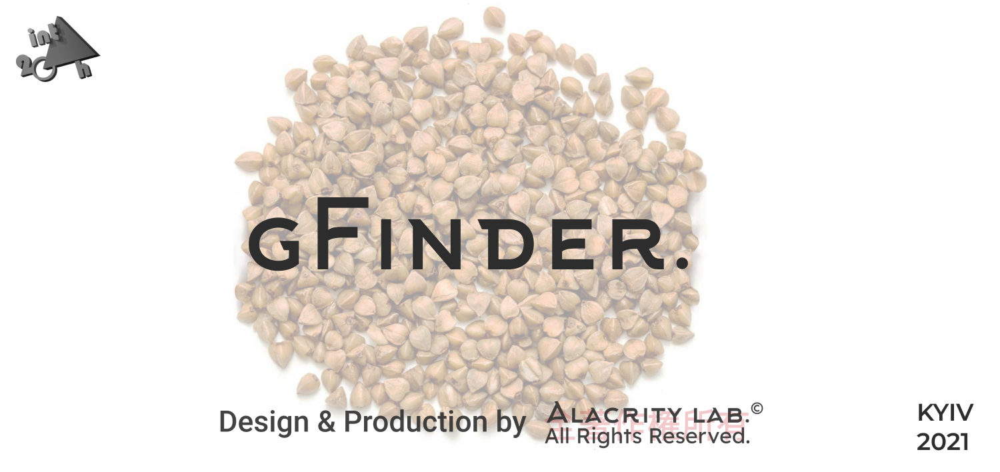
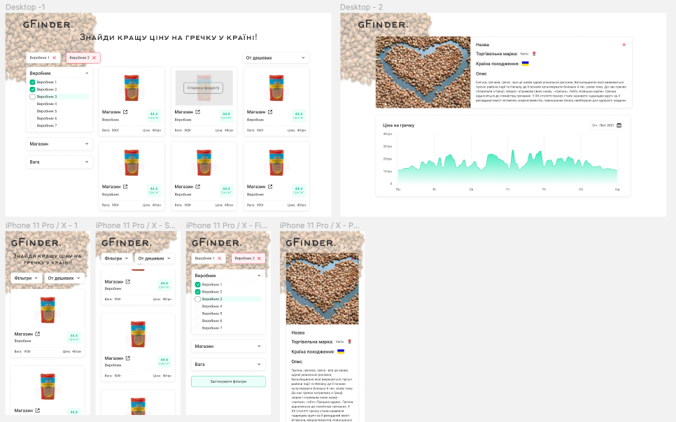

<p align="center">
  
</p>

# gFinder

gFinder is a website wich shows the best offers of buckwheet in Ukraine.
To achieve this goal we are searching thru the offers of different stores and,
calculating the price for kilo, showing you best deals for your buck.

Project using in core [NestJS](https://github.com/nestjs/nest) made with ❤️ by [💡AlacrityLab💡](https://www.alacritylab.io).


## Task

- [x] The product shoud be buckwheet, not any other.

- [x] Searching for offers should be done minimum in 3 stores.

- [x] Updating data on page reload.

- [x] Serving using cloud services (Heroku, Azure, etc).

### Additional:

- [x] Using Docker.

- [x] Display all found offers sorted by price

- [x] Implement serching for other products

- [x] Implement serach filters (weight, producent, etc).

### Hardcore:

- [x] Display a chart of prices of buckwheet on a some time period in different stores or overall chart of buckwheet cost.

## Build with
<p align="left"> <a href="https://babeljs.io/" target="_blank">  </a> <a href="https://www.gnu.org/software/bash/" target="_blank">  </a> <a href="https://www.chartjs.org" target="_blank">  </a> <a href="https://www.w3schools.com/css/" target="_blank">  </a> <a href="https://www.docker.com/" target="_blank">  </a> <a href="https://expressjs.com" target="_blank">  </a> <a href="https://www.figma.com/" target="_blank">  </a> <a href="https://git-scm.com/" target="_blank">  </a> <a href="https://heroku.com" target="_blank">  </a> <a href="https://jestjs.io" target="_blank">  </a> <a href="https://www.linux.org/" target="_blank">  </a> <a href="https://nextjs.org/" target="_blank">  </a> <a href="https://www.nginx.com" target="_blank">  </a> <a href="https://nodejs.org" target="_blank">  </a> <a href="https://www.postgresql.org" target="_blank">  </a> <a href="https://reactjs.org/" target="_blank">  </a> <a href="https://redis.io" target="_blank">  </a> <a href="https://www.typescriptlang.org/" target="_blank">  </a><a href="https://nestjs.com/" target="blank">
  
</a> </p>

## Design
### All design is done in [Figma](https://www.figma.com/file/lAlaSovXYQLq1yOaV3sYHH/GFinder?node-id=0%3A1)

<p align="center">
  
</p>

## Start Guide

### Outside Docker containers
- Create .env file `cp .env.example .env` and replace existing env variables
  (mysql/mariadb connection params)
- Install dependencies `yarn`
- Start the app `yarn start` (app will be exposed through the port 3000)

### Inside Docker containers

Just run already prepared docker-compose:
```bash
$ docker-compose build
$ docker-compose up
```
It will setup the project for you (building the Docker images, starting docker-compose stack).
The NestJS app running in dev mode will be exposed on `http://localhost` (port 80)

For IDE autocompletion to work, run `yarn` on the host machine.

## Test

```bash
# unit tests
$ docker exec -it gfinder-server yarn test

# e2e tests
$ docker exec -it gfinder-server yarn test:e2e

# test coverage
$ docker exec -it gfinder-server yarn test:cov
```

## Environment Configuration

Integrated Configuration Module so you can just inject `ConfigService`
and read all environment variables from `.env` file, which is created automatically by the init script from `.env.example`.

## Documentation

To generate documentation of source code use following npm script:

```bash
#generate documentation
yarn docs
```

and find documentation in folder `./documentation`

## Contact

<p>
<a href="https://alacritylab.io/" target="blank" >
  
</a>
 or in 
<a href="t.me/@noname_vs" target="blank" >
    Telegram
    
</a>
</p>

## LICENSE

This project is licensed under a <a rel="license" href="http://creativecommons.org/licenses/by-nc-nd/4.0/">Creative Commons Attribution-NonCommercial-NoDerivatives 4.0 International License</a><a rel="license" href="http://creativecommons.org/licenses/by-nc-nd/4.0/">
  
</a>
